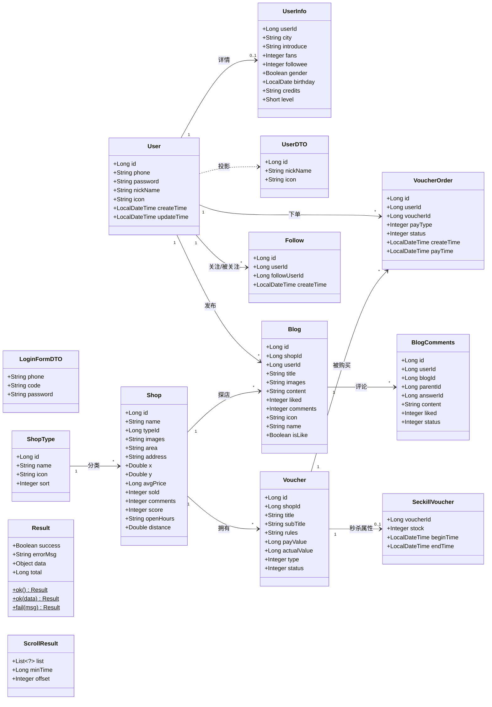

# 类图 - 实体层（com.hmdp.entity / com.hmdp.dto）

```mermaid
classDiagram
    direction LR

    class User {
        +Long id
        +String phone
        +String password
        +String nickName
        +String icon
        +LocalDateTime createTime
        +LocalDateTime updateTime
    }

    class UserInfo {
        +Long userId
        +String city
        +String introduce
        +Integer fans
        +Integer followee
        +Boolean gender
        +LocalDate birthday
        +String credits
        +Short level
    }

    class UserDTO {
        +Long id
        +String nickName
        +String icon
    }

    class LoginFormDTO {
        +String phone
        +String code
        +String password
    }

    class Shop {
        +Long id
        +String name
        +Long typeId
        +String images
        +String area
        +String address
        +Double x
        +Double y
        +Long avgPrice
        +Integer sold
        +Integer comments
        +Integer score
        +String openHours
        +Double distance
    }

    class ShopType {
        +Long id
        +String name
        +String icon
        +Integer sort
    }

    class Blog {
        +Long id
        +Long shopId
        +Long userId
        +String title
        +String images
        +String content
        +Integer liked
        +Integer comments
        +String icon
        +String name
        +Boolean isLike
    }

    class BlogComments {
        +Long id
        +Long userId
        +Long blogId
        +Long parentId
        +Long answerId
        +String content
        +Integer liked
        +Integer status
    }

    class Follow {
        +Long id
        +Long userId
        +Long followUserId
        +LocalDateTime createTime
    }

    class Voucher {
        +Long id
        +Long shopId
        +String title
        +String subTitle
        +String rules
        +Long payValue
        +Long actualValue
        +Integer type
        +Integer status
    }

    class SeckillVoucher {
        +Long voucherId
        +Integer stock
        +LocalDateTime beginTime
        +LocalDateTime endTime
    }

    class VoucherOrder {
        +Long id
        +Long userId
        +Long voucherId
        +Integer payType
        +Integer status
        +LocalDateTime createTime
        +LocalDateTime payTime
    }

    class Result {
        +Boolean success
        +String errorMsg
        +Object data
        +Long total
        +ok() Result$
        +ok(data) Result$
        +fail(msg) Result$
    }

    class ScrollResult {
        +List~?~ list
        +Long minTime
        +Integer offset
    }

    User "1" --> "0..1" UserInfo : 详情
    User ..> UserDTO : 投影
    User "1" --> "*" Blog : 发布
    User "1" --> "*" Follow : 关注/被关注
    User "1" --> "*" VoucherOrder : 下单

    Shop "1" --> "*" Blog : 探店
    ShopType "1" --> "*" Shop : 分类
    Shop "1" --> "*" Voucher : 拥有

    Voucher "1" --> "0..1" SeckillVoucher : 秒杀属性
    Voucher "1" --> "*" VoucherOrder : 被购买

    Blog "1" --> "*" BlogComments : 评论
```
