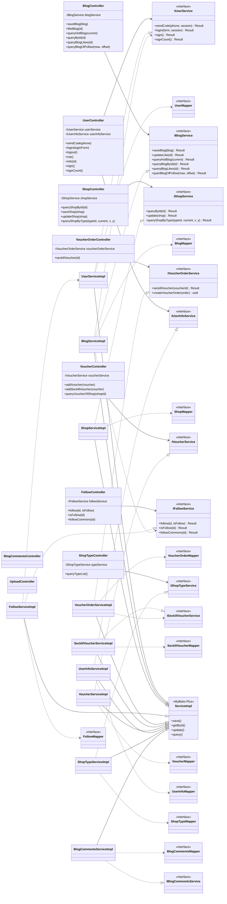

# 类图 - 三层架构（Controller / Service / Mapper）

```mermaid
classDiagram
    direction LR

    %% ========== Controller ==========
    class UserController {
        -IUserService userService
        -IUserInfoService userInfoService
        +sendCode(phone)
        +login(loginForm)
        +logout()
        +me()
        +info(id)
        +sign()
        +signCount()
    }
    class BlogController {
        -IBlogService blogService
        +saveBlog(blog)
        +likeBlog(id)
        +queryHotBlog(current)
        +queryById(id)
        +queryBlogLikes(id)
        +queryBlogOfFollow(max, offset)
    }
    class ShopController {
        -IShopService shopService
        +queryShopById(id)
        +saveShop(shop)
        +updateShop(shop)
        +queryShopByType(typeId, current, x, y)
    }
    class FollowController {
        -IFollowService followService
        +follow(id, isFollow)
        +isFollow(id)
        +followCommons(id)
    }
    class VoucherController {
        -IVoucherService voucherService
        +addVoucher(voucher)
        +addSeckillVoucher(voucher)
        +queryVoucherOfShop(shopId)
    }
    class VoucherOrderController {
        -IVoucherOrderService voucherOrderService
        +seckillVoucher(id)
    }
    class ShopTypeController {
        -IShopTypeService typeService
        +queryTypeList()
    }
    class BlogCommentsController
    class UploadController

    %% ========== Service Interface ==========
    class IUserService {
        <<interface>>
        +sendCode(phone, session) Result
        +login(form, session) Result
        +sign() Result
        +signCount() Result
    }
    class IBlogService {
        <<interface>>
        +saveBlog(blog) Result
        +updateLike(id) Result
        +queryHotBlog(current) Result
        +queryBlogById(id) Result
        +queryBlogLikes(id) Result
        +quertBlogOfFollow(max, offset) Result
    }
    class IShopService {
        <<interface>>
        +queryById(id) Result
        +update(shop) Result
        +queryShopByType(typeId, current, x, y) Result
    }
    class IFollowService {
        <<interface>>
        +follow(id, isFollow) Result
        +isFollow(id) Result
        +followCommons(id) Result
    }
    class IVoucherOrderService {
        <<interface>>
        +seckillVoucher(voucherId) Result
        +createVoucherOrder(order) void
    }
    class ISeckillVoucherService {
        <<interface>>
    }
    class IVoucherService {
        <<interface>>
    }
    class IUserInfoService {
        <<interface>>
    }
    class IShopTypeService {
        <<interface>>
    }
    class IBlogCommentsService {
        <<interface>>
    }

    %% ========== Service Impl ==========
    class UserServiceImpl
    class BlogServiceImpl
    class ShopServiceImpl
    class FollowServiceImpl
    class VoucherOrderServiceImpl
    class SeckillVoucherServiceImpl
    class VoucherServiceImpl
    class UserInfoServiceImpl
    class ShopTypeServiceImpl
    class BlogCommentsServiceImpl

    %% ========== Mapper ==========
    class UserMapper { <<interface>> }
    class BlogMapper { <<interface>> }
    class ShopMapper { <<interface>> }
    class FollowMapper { <<interface>> }
    class VoucherMapper { <<interface>> }
    class VoucherOrderMapper { <<interface>> }
    class SeckillVoucherMapper { <<interface>> }
    class UserInfoMapper { <<interface>> }
    class ShopTypeMapper { <<interface>> }
    class BlogCommentsMapper { <<interface>> }

    class ServiceImpl {
        <<MyBatis-Plus>>
        +save()
        +getById()
        +update()
        +query()
    }

    %% ========== Controller -> Service ==========
    UserController --> IUserService
    UserController --> IUserInfoService
    BlogController --> IBlogService
    ShopController --> IShopService
    FollowController --> IFollowService
    VoucherController --> IVoucherService
    VoucherOrderController --> IVoucherOrderService
    ShopTypeController --> IShopTypeService

    %% ========== Service Impl -> Interface ==========
    UserServiceImpl ..|> IUserService
    BlogServiceImpl ..|> IBlogService
    ShopServiceImpl ..|> IShopService
    FollowServiceImpl ..|> IFollowService
    VoucherOrderServiceImpl ..|> IVoucherOrderService
    SeckillVoucherServiceImpl ..|> ISeckillVoucherService
    VoucherServiceImpl ..|> IVoucherService
    UserInfoServiceImpl ..|> IUserInfoService
    ShopTypeServiceImpl ..|> IShopTypeService
    BlogCommentsServiceImpl ..|> IBlogCommentsService

    %% ========== Service Impl -> ServiceImpl<Mapper, Entity> ==========
    UserServiceImpl --|> ServiceImpl
    BlogServiceImpl --|> ServiceImpl
    ShopServiceImpl --|> ServiceImpl
    FollowServiceImpl --|> ServiceImpl
    VoucherOrderServiceImpl --|> ServiceImpl
    SeckillVoucherServiceImpl --|> ServiceImpl
    VoucherServiceImpl --|> ServiceImpl
    UserInfoServiceImpl --|> ServiceImpl
    ShopTypeServiceImpl --|> ServiceImpl
    BlogCommentsServiceImpl --|> ServiceImpl

    %% ========== Service Impl -> Mapper ==========
    UserServiceImpl ..> UserMapper
    BlogServiceImpl ..> BlogMapper
    ShopServiceImpl ..> ShopMapper
    FollowServiceImpl ..> FollowMapper
    VoucherServiceImpl ..> VoucherMapper
    VoucherOrderServiceImpl ..> VoucherOrderMapper
    SeckillVoucherServiceImpl ..> SeckillVoucherMapper
    UserInfoServiceImpl ..> UserInfoMapper
    ShopTypeServiceImpl ..> ShopTypeMapper
    BlogCommentsServiceImpl ..> BlogCommentsMapper

    %% ========== 服务之间的依赖 ==========
    BlogServiceImpl ..> IUserService
    BlogServiceImpl ..> IFollowService
    FollowServiceImpl ..> UserServiceImpl
    VoucherOrderServiceImpl ..> ISeckillVoucherService
```
