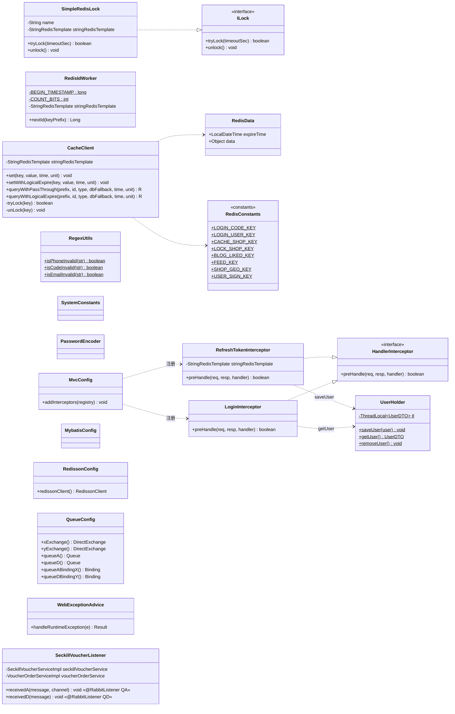

# 类图 - 工具类 / 拦截器 / 配置 / MQ 监听

```mermaid
classDiagram
    direction LR

    %% ========== Utils ==========
    class CacheClient {
        -StringRedisTemplate stringRedisTemplate
        +set(key, value, time, unit) void
        +setWithLogicalExpire(key, value, time, unit) void
        +queryWithPassThrough(prefix, id, type, dbFallback, time, unit) R
        +queryWithLogicalExpire(prefix, id, type, dbFallback, time, unit) R
        -tryLock(key) boolean
        -unLock(key) void
    }

    class RedisIdWorker {
        -BEGIN_TIMESTAMP : long$
        -COUNT_BITS : int$
        -StringRedisTemplate stringRedisTemplate
        +nextId(keyPrefix) Long
    }

    class ILock {
        <<interface>>
        +tryLock(timeoutSec) boolean
        +unlock() void
    }

    class SimpleRedisLock {
        -String name
        -StringRedisTemplate stringRedisTemplate
        +tryLock(timeoutSec) boolean
        +unlock() void
    }
    SimpleRedisLock ..|> ILock

    class UserHolder {
        -ThreadLocal~UserDTO~ tl$
        +saveUser(user)$ void
        +getUser()$ UserDTO
        +removeUser()$ void
    }

    class RedisData {
        +LocalDateTime expireTime
        +Object data
    }

    class RegexUtils {
        +isPhoneInvalid(str)$ boolean
        +isCodeInvalid(str)$ boolean
        +isEmailInvalid(str)$ boolean
    }

    class RedisConstants {
        <<constants>>
        +LOGIN_CODE_KEY$
        +LOGIN_USER_KEY$
        +CACHE_SHOP_KEY$
        +LOCK_SHOP_KEY$
        +BLOG_LIKED_KEY$
        +FEED_KEY$
        +SHOP_GEO_KEY$
        +USER_SIGN_KEY$
    }

    class SystemConstants
    class PasswordEncoder

    %% ========== Interceptor ==========
    class HandlerInterceptor {
        <<interface>>
        +preHandle(req, resp, handler) boolean
    }

    class RefreshTokenInterceptor {
        -StringRedisTemplate stringRedisTemplate
        +preHandle(req, resp, handler) boolean
    }
    class LoginInterceptor {
        +preHandle(req, resp, handler) boolean
    }
    RefreshTokenInterceptor ..|> HandlerInterceptor
    LoginInterceptor ..|> HandlerInterceptor

    %% ========== Config ==========
    class MvcConfig {
        +addInterceptors(registry) void
    }
    class MybatisConfig
    class RedissonConfig {
        +redissonClient() RedissonClient
    }
    class QueueConfig {
        +xExchange() DirectExchange
        +yExchange() DirectExchange
        +queueA() Queue
        +queueD() Queue
        +queueABindingX() Binding
        +queueDBindingY() Binding
    }
    class WebExceptionAdvice {
        +handleRuntimeException(e) Result
    }

    %% ========== Listener ==========
    class SeckillVoucherListener {
        -SeckillVoucherServiceImpl seckillVoucherService
        -VoucherOrderServiceImpl voucherOrderService
        +receivedA(message, channel) void  «@RabbitListener QA»
        +receivedD(message) void           «@RabbitListener QD»
    }

    %% ========== 关系 ==========
    MvcConfig ..> RefreshTokenInterceptor : 注册
    MvcConfig ..> LoginInterceptor : 注册
    RefreshTokenInterceptor ..> UserHolder : saveUser
    LoginInterceptor ..> UserHolder : getUser
    CacheClient ..> RedisData
    CacheClient ..> RedisConstants
```
