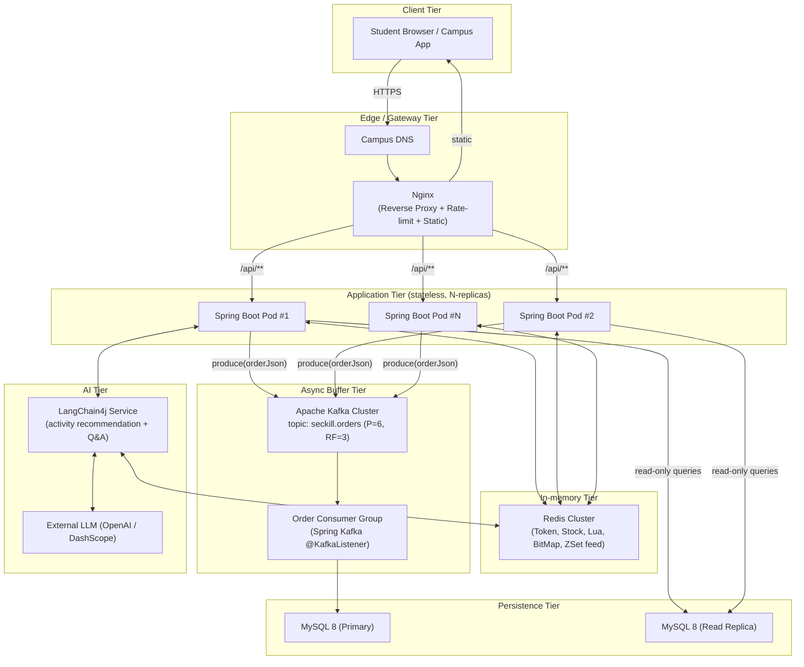

# Section 5 — System Architecture

> Project context: an **on-campus flash-sale (seckill) platform** that offers limited
> activities to verified students — for example, subsidised cafeteria coupons, gym
> slot booking, library group-room reservations, club-event tickets, and the
> campus second-hand book market. Each event opens at a fixed timestamp, exposes
> a small, fixed inventory (typically 50 – 1,000 items) and must enforce a strict
> **one-student-one-order** rule. Expected peak load is **200 – 300 QPS** during
> the first ten seconds of every event.

## 5.1 Architectural Goals

| Goal              | Description                                                                                              |
| ----------------- | -------------------------------------------------------------------------------------------------------- |
| Anti-oversell     | Inventory must never become negative under arbitrary concurrency.                                        |
| Idempotency       | A student may submit the same purchase request many times but must hold at most one order.               |
| Low latency       | p99 response time of the seckill endpoint < **300 ms** at the peak load.                                 |
| Graceful failure  | When downstream MySQL or Kafka degrades, the front gate (Nginx + Redis) still rejects fraudulent traffic |
| Horizontal scale  | The application tier is stateless so additional Spring Boot pods can be added behind Nginx.              |
| Auditability      | Every accepted order is persisted in MySQL with a globally unique snowflake-style ID for reconciliation. |

## 5.2 Layered / Deployment Diagram

## 5.3 Request Flow under Peak Load

The following narrative tracks one purchase request through the architecture and
explains **how each tier protects the next**.

### Step 1 — Edge filtering (Nginx)

* Nginx terminates TLS, serves the SPA's static bundle, and reverse-proxies
  `/api/**` to the application tier with `least_conn` load-balancing.
* Per-IP and per-token rate-limit zones (`limit_req_zone $binary_remote_addr
  zone=seckill:10m rate=20r/s`) reject obvious bots **before any Spring Boot
  thread is consumed**. This caps the absolute traffic that ever reaches the
  JVMs and is the first defence against script-based brute-force attempts.

### Step 2 — Authentication (Spring Boot + Redis)

* Each request carries an `authorization: <token>` header issued at login.
* The `RefreshTokenInterceptor` performs a single Redis `HGETALL login:token:{token}`,
  hydrates a `UserDTO` into `ThreadLocal` and slides the TTL by 30 minutes.
* The `LoginInterceptor` rejects unauthenticated traffic with HTTP 401 — the
  database is never touched by anonymous requests.

### Step 3 — Hot-path read shielding (Redis)

* Catalog data (event details, shop info, voucher meta) is cached in Redis with
  the **logical-expire** strategy (`CacheClient#queryWithLogicalExpire`).
  A single mutex per key prevents the cache-stampede effect when an entry
  logically expires.
* Inventory and the per-user "already bought" set are kept **entirely in Redis**
  during the open window of the event. The Java code never queries MySQL for
  the stock value during the hot phase.

### Step 4 — Atomic admission via a Lua script

* `seckillVoucher(voucherId)` calls `EVAL seckill.lua` with `(voucherId, userId,
  orderId)`. The script atomically:
  1. checks `stock:{voucherId} > 0`,
  2. checks the user is not already in the `orders:{voucherId}` set,
  3. decrements the stock and records the user.
* The script returns `0` (success) / `1` (out of stock) / `2` (duplicate). Because
  Redis runs Lua single-threaded, **overselling is impossible at this layer**
  even under unbounded concurrency. This is the principal anti-oversell
  guarantee of the system.

### Step 5 — Peak shaving via Kafka

* On `result == 0`, the controller produces a JSON `OrderEvent` to the
  `seckill.orders` topic, then **immediately returns the order id** to the
  student. End-to-end latency for the synchronous path stays well under 100 ms
  because no JDBC call is on the request thread.
* Kafka acts as a durable bounded buffer between the bursty front end (≈ 300 QPS
  for a few seconds) and the steady write throughput that MySQL can sustain
  (≈ 80–120 inserts/s on a campus VM). The topic is partitioned by `userId %
  P`, which keeps order events for the same student on the same partition — a
  natural FIFO guarantee that simplifies the consumer's idempotency logic.
* Producer config: `acks=all`, `enable.idempotence=true`, `linger.ms=5`,
  `compression.type=lz4`. Retries with exponential back-off cover transient
  broker disconnections.

### Step 6 — Asynchronous persistence (Kafka consumer → MySQL)

* A consumer group reads from `seckill.orders`, validates the event (still under
  one-order-per-user via `INSERT ... ON DUPLICATE KEY UPDATE` on a unique
  `(user_id, voucher_id)` index) and decrements the persistent `stock` column
  with the optimistic guard `WHERE voucher_id=? AND stock > 0`.
* If the database write fails, the consumer commits no offset — Kafka redelivers
  on the next poll, giving us at-least-once semantics that pair safely with the
  unique index.
* Read traffic for "my orders / order detail" routes to a MySQL **read
  replica** to keep the primary focused on the consumer's writes.

### Step 7 — AI assistance (LangChain4j)

* A separate `recommend` controller calls a LangChain4j-based service that
  combines a vector store of historical activity descriptions with an external
  LLM to answer free-form student questions ("which gym slots tomorrow still
  have spots?") and to recommend personalised activities.
* The AI tier is **out of the critical seckill path**; degradation here cannot
  affect anti-oversell correctness.

## 5.4 Why this design satisfies the goals

| Goal               | How                                                                        |
| ------------------ | -------------------------------------------------------------------------- |
| Anti-oversell      | Lua atomic decrement in Redis + unique `(user_id, voucher_id)` index in DB |
| Idempotency        | Same Lua check + DB unique index; Kafka at-least-once is safe              |
| Low latency        | Synchronous request only touches Redis; MySQL is off the hot path          |
| Graceful failure   | Nginx rate-limit + Redis admission keep DB healthy when MQ is slow         |
| Horizontal scale   | Spring Boot pods are stateless; tokens live in Redis; add pods as needed   |
| Auditability       | Every accepted order is on Kafka and ultimately in MySQL with a unique ID  |

## 5.5 Migration note (current vs. target)

The current code base ships with **RabbitMQ** (`spring-boot-starter-amqp`,
`SeckillVoucherListener`) as the asynchronous buffer. The target architecture
above replaces it with Kafka because:

* Kafka's partition-level ordering matches our `userId`-keyed idempotency model.
* Kafka's consumer-group rebalancing makes scaling order-consumers trivial as
  more events run in parallel.
* The disk-based log retains events for replay and post-mortem analysis after
  every event, which is useful for the campus operations team.

The migration is a drop-in change: producer in `VoucherOrderServiceImpl` and the
consumer in `SeckillVoucherListener` are the only files that must move from
`RabbitTemplate` / `@RabbitListener` to `KafkaTemplate` / `@KafkaListener`.
