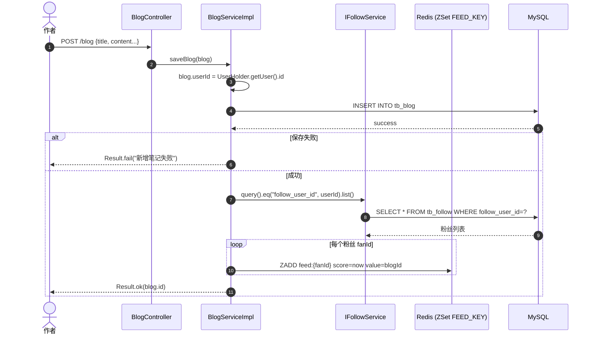
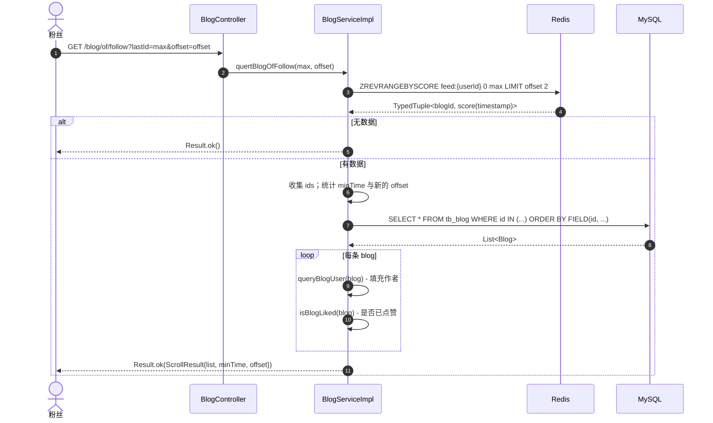
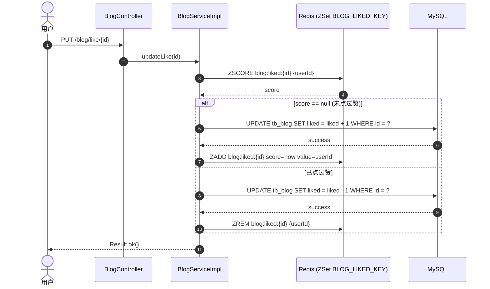
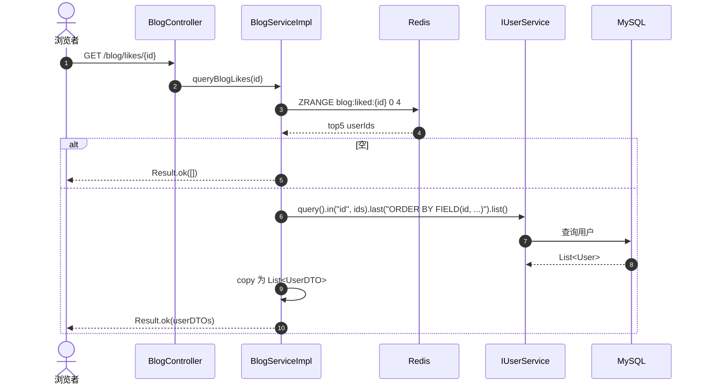

# 时序图 - 探店笔记发布 / 点赞 / 关注 Feed 流

## 1. 发布笔记 + Feed 推送（写扩散）

```mermaid
sequenceDiagram
    autonumber
    actor U as 作者
    participant C as BlogController
    participant BS as BlogServiceImpl
    participant FS as IFollowService
    participant R as Redis (ZSet FEED_KEY)
    participant DB as MySQL

    U->>C: POST /blog {title, content...}
    C->>BS: saveBlog(blog)
    BS->>BS: blog.userId = UserHolder.getUser().id
    BS->>DB: INSERT INTO tb_blog
    DB-->>BS: success
    alt 保存失败
        BS-->>U: Result.fail("新增笔记失败")
    else 成功
        BS->>FS: query().eq("follow_user_id", userId).list()
        FS->>DB: SELECT * FROM tb_follow WHERE follow_user_id=?
        DB-->>FS: 粉丝列表
        loop 每个粉丝 fanId
            BS->>R: ZADD feed:{fanId} score=now value=blogId
        end
        BS-->>U: Result.ok(blog.id)
    end
```

## 2. 滚动查询「我关注的人」的 Feed（读时分页）

```mermaid
sequenceDiagram
    autonumber
    actor U as 粉丝
    participant C as BlogController
    participant BS as BlogServiceImpl
    participant R as Redis
    participant DB as MySQL

    U->>C: GET /blog/of/follow?lastId=max&offset=offset
    C->>BS: quertBlogOfFollow(max, offset)
    BS->>R: ZREVRANGEBYSCORE feed:{userId} 0 max LIMIT offset 2
    R-->>BS: TypedTuple<blogId, score(timestamp)>
    alt 无数据
        BS-->>U: Result.ok()
    else 有数据
        BS->>BS: 收集 ids；统计 minTime 与新的 offset
        BS->>DB: SELECT * FROM tb_blog WHERE id IN (...) ORDER BY FIELD(id, ...)
        DB-->>BS: List<Blog>
        loop 每条 blog
            BS->>BS: queryBlogUser(blog) - 填充作者
            BS->>BS: isBlogLiked(blog) - 是否已点赞
        end
        BS-->>U: Result.ok(ScrollResult{list, minTime, offset})
    end
```

## 3. 点赞 / 取消点赞（ZSet 排序）

```mermaid
sequenceDiagram
    autonumber
    actor U as 用户
    participant C as BlogController
    participant BS as BlogServiceImpl
    participant R as Redis (ZSet BLOG_LIKED_KEY)
    participant DB as MySQL

    U->>C: PUT /blog/like/{id}
    C->>BS: updateLike(id)
    BS->>R: ZSCORE blog:liked:{id} {userId}
    R-->>BS: score
    alt score == null  (未点过赞)
        BS->>DB: UPDATE tb_blog SET liked = liked + 1 WHERE id = ?
        DB-->>BS: success
        BS->>R: ZADD blog:liked:{id} score=now value=userId
    else 已点过赞
        BS->>DB: UPDATE tb_blog SET liked = liked - 1 WHERE id = ?
        DB-->>BS: success
        BS->>R: ZREM blog:liked:{id} {userId}
    end
    BS-->>U: Result.ok()
```

## 4. 查看 Top5 点赞用户

```mermaid
sequenceDiagram
    autonumber
    actor U as 浏览者
    participant C as BlogController
    participant BS as BlogServiceImpl
    participant R as Redis
    participant US as IUserService
    participant DB as MySQL

    U->>C: GET /blog/likes/{id}
    C->>BS: queryBlogLikes(id)
    BS->>R: ZRANGE blog:liked:{id} 0 4
    R-->>BS: top5 userIds
    alt 空
        BS-->>U: Result.ok([])
    else
        BS->>US: query().in("id", ids).last("ORDER BY FIELD(id, ...)").list()
        US->>DB: 查询用户
        DB-->>US: List<User>
        BS->>BS: copy 为 List<UserDTO>
        BS-->>U: Result.ok(userDTOs)
    end
```
