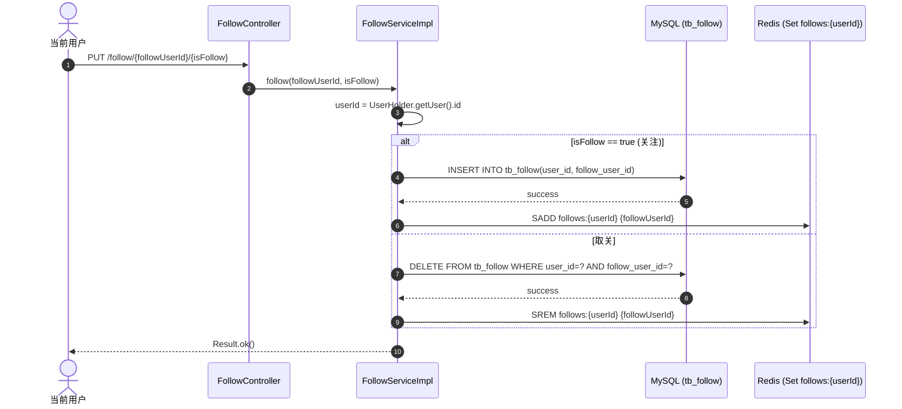
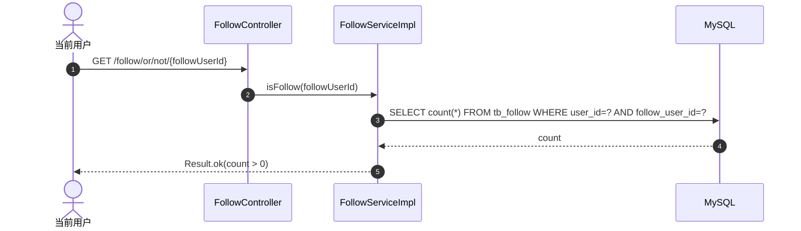
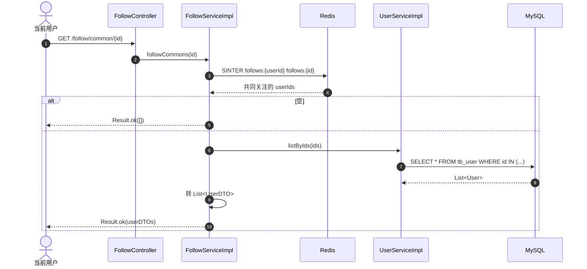

# 时序图 - 关注 / 取关 / 共同关注

## 1. 关注 / 取关

```mermaid
sequenceDiagram
    autonumber
    actor U as 当前用户
    participant C as FollowController
    participant FS as FollowServiceImpl
    participant DB as MySQL (tb_follow)
    participant R as Redis (Set follows:{userId})

    U->>C: PUT /follow/{followUserId}/{isFollow}
    C->>FS: follow(followUserId, isFollow)
    FS->>FS: userId = UserHolder.getUser().id
    alt isFollow == true (关注)
        FS->>DB: INSERT INTO tb_follow(user_id, follow_user_id)
        DB-->>FS: success
        FS->>R: SADD follows:{userId} {followUserId}
    else 取关
        FS->>DB: DELETE FROM tb_follow WHERE user_id=? AND follow_user_id=?
        DB-->>FS: success
        FS->>R: SREM follows:{userId} {followUserId}
    end
    FS-->>U: Result.ok()
```

## 2. 是否已关注

```mermaid
sequenceDiagram
    autonumber
    actor U as 当前用户
    participant C as FollowController
    participant FS as FollowServiceImpl
    participant DB as MySQL

    U->>C: GET /follow/or/not/{followUserId}
    C->>FS: isFollow(followUserId)
    FS->>DB: SELECT count(*) FROM tb_follow WHERE user_id=? AND follow_user_id=?
    DB-->>FS: count
    FS-->>U: Result.ok(count > 0)
```

## 3. 共同关注（Redis Set 求交集）

```mermaid
sequenceDiagram
    autonumber
    actor U as 当前用户
    participant C as FollowController
    participant FS as FollowServiceImpl
    participant R as Redis
    participant US as UserServiceImpl
    participant DB as MySQL

    U->>C: GET /follow/common/{id}
    C->>FS: followCommons(id)
    FS->>R: SINTER follows:{userId} follows:{id}
    R-->>FS: 共同关注的 userIds
    alt 空
        FS-->>U: Result.ok([])
    else
        FS->>US: listByIds(ids)
        US->>DB: SELECT * FROM tb_user WHERE id IN (...)
        DB-->>US: List<User>
        FS->>FS: 转 List<UserDTO>
        FS-->>U: Result.ok(userDTOs)
    end
```
