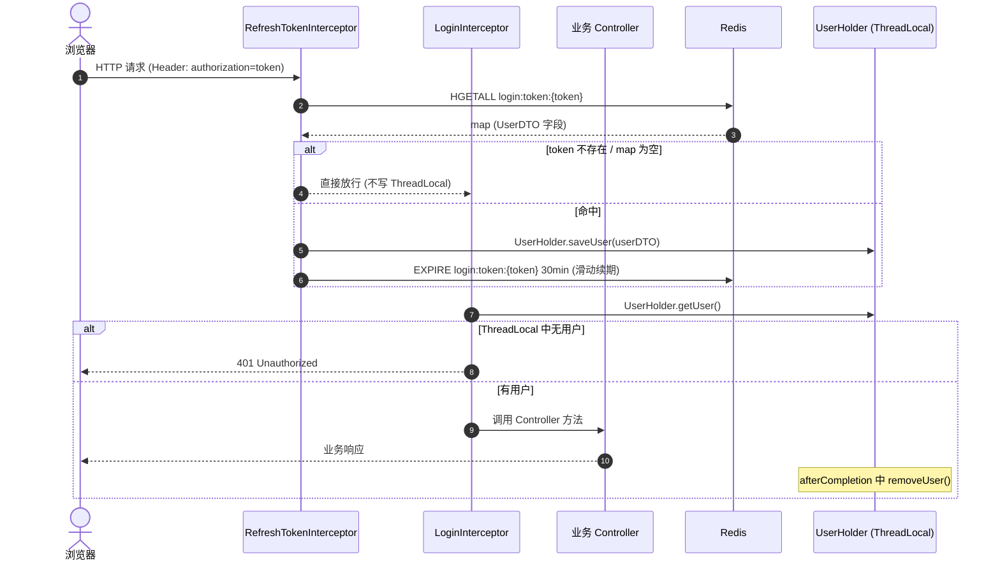

# 时序图 - 手机号登录 / Token 校验

## 1. 发送验证码 + 登录

```mermaid
sequenceDiagram
    autonumber
    actor U as 用户
    participant C as UserController
    participant S as UserServiceImpl
    participant R as Redis (StringRedisTemplate)
    participant DB as MySQL (UserMapper)

    %% --- 发送验证码 ---
    U->>C: POST /user/code?phone=xxx
    C->>S: sendCode(phone, session)
    S->>S: RegexUtils.isPhoneInvalid(phone)
    alt 手机号非法
        S-->>C: Result.fail("手机号格式错误")
        C-->>U: 400 失败
    else 手机号合法
        S->>S: code = RandomUtil.randomNumbers(6)
        S->>R: SET login:code:{phone} = code (TTL 2min)
        S-->>C: Result.ok()
        C-->>U: 200
    end

    %% --- 登录 ---
    U->>C: POST /user/login {phone, code}
    C->>S: login(loginForm)
    S->>R: GET login:code:{phone}
    R-->>S: cacheCode
    alt 验证码不一致
        S-->>U: Result.fail("验证码不一致")
    else 一致
        S->>DB: SELECT * FROM tb_user WHERE phone=?
        DB-->>S: user / null
        opt 用户不存在
            S->>DB: INSERT new user (随机 nickName)
        end
        S->>S: token = UUID; UserDTO = copy(user)
        S->>R: HMSET login:token:{token} = userMap (TTL 30min)
        S-->>C: Result.ok(token)
        C-->>U: 200, body = token
    end
```

## 2. 每个请求的 Token 刷新与登录拦截


