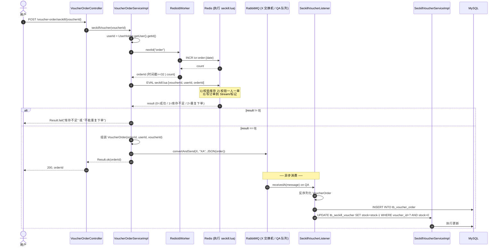
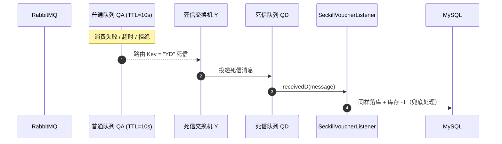
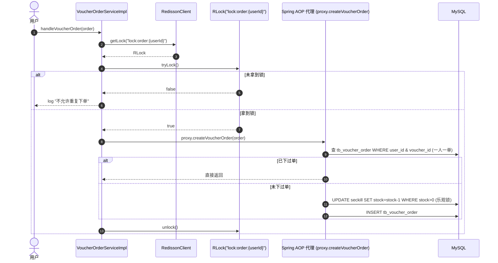

# 时序图 - 优惠券秒杀（Lua + RabbitMQ 异步下单）

## 1. 下单主流程（同步部分 + 异步落库）

```mermaid
sequenceDiagram
    autonumber
    actor U as 用户
    participant C as VoucherOrderController
    participant S as VoucherOrderServiceImpl
    participant ID as RedisIdWorker
    participant R as Redis (执行 seckill.lua)
    participant MQ as RabbitMQ (X 交换机 / QA 队列)
    participant L as SeckillVoucherListener
    participant SV as SeckillVoucherServiceImpl
    participant DB as MySQL

    U->>C: POST /voucher-order/seckill/{voucherId}
    C->>S: seckillVoucher(voucherId)

    S->>S: userId = UserHolder.getUser().getId()
    S->>ID: nextId("order")
    ID->>R: INCR icr:order:{date}
    R-->>ID: count
    ID-->>S: orderId (时间戳<<32 | count)

    S->>R: EVAL seckill.lua [voucherId, userId, orderId]
    Note over R: 1) 校验库存 2) 校验一人一单<br/>3) 写订单到 Stream/标记
    R-->>S: result (0=成功 / 1=库存不足 / 2=重复下单)

    alt result != 0
        S-->>U: Result.fail("库存不足" 或 "不能重复下单")
    else result == 0
        S->>S: 组装 VoucherOrder(orderId, userId, voucherId)
        S->>MQ: convertAndSend(X, "XA", JSON(order))
        S-->>C: Result.ok(orderId)
        C-->>U: 200, orderId

        Note over MQ,L: ── 异步消费 ──
        MQ->>L: receivedA(message) on QA
        L->>L: 反序列化 VoucherOrder
        L->>DB: INSERT INTO tb_voucher_order
        L->>SV: UPDATE tb_seckill_voucher SET stock=stock-1 WHERE voucher_id=? AND stock>0
        SV->>DB: 执行更新
    end
```

## 2. 死信队列兜底

```mermaid
sequenceDiagram
    autonumber
    participant MQ as RabbitMQ
    participant QA as 普通队列 QA (TTL=10s)
    participant Y as 死信交换机 Y
    participant QD as 死信队列 QD
    participant L as SeckillVoucherListener
    participant DB as MySQL

    Note over QA: 消费失败 / 超时 / 拒绝
    QA-->>Y: 路由 Key = "YD" 死信
    Y->>QD: 投递死信消息
    QD->>L: receivedD(message)
    L->>DB: 同样落库 + 库存 -1（兜底处理）
```

## 3. 分布式锁版本（备选实现，已注释）

```mermaid
sequenceDiagram
    autonumber
    actor U as 用户
    participant S as VoucherOrderServiceImpl
    participant RC as RedissonClient
    participant Lock as RLock("lock:order:{userId}")
    participant Proxy as Spring AOP 代理 (proxy.createVoucherOrder)
    participant DB as MySQL

    U->>S: handleVoucherOrder(order)
    S->>RC: getLock("lock:order:{userId}")
    RC-->>S: RLock
    S->>Lock: tryLock()
    alt 未拿到锁
        Lock-->>S: false
        S-->>U: log "不允许重复下单"
    else 拿到锁
        Lock-->>S: true
        S->>Proxy: proxy.createVoucherOrder(order)
        Proxy->>DB: 查 tb_voucher_order WHERE user_id & voucher_id  (一人一单)
        alt 已下过单
            Proxy-->>S: 直接返回
        else 未下过单
            Proxy->>DB: UPDATE seckill SET stock=stock-1 WHERE stock>0 (乐观锁)
            Proxy->>DB: INSERT tb_voucher_order
        end
        S->>Lock: unlock()
    end
```
