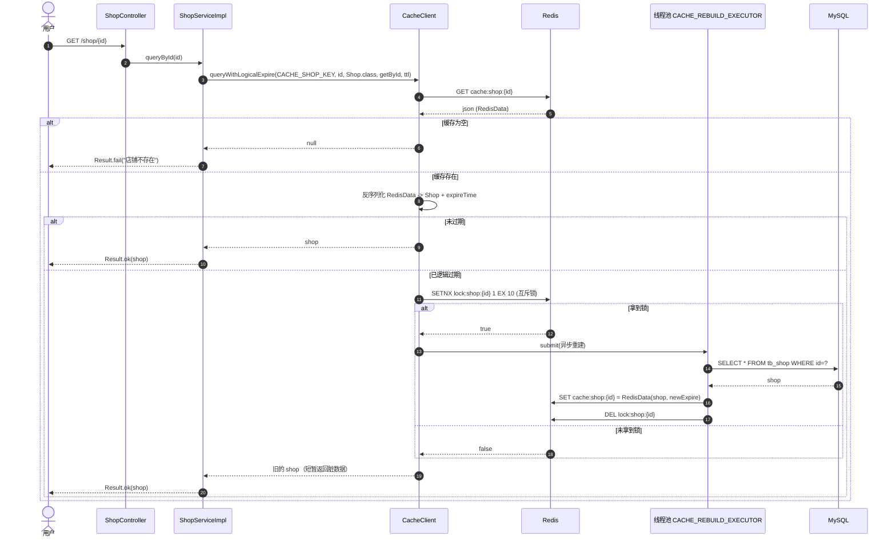
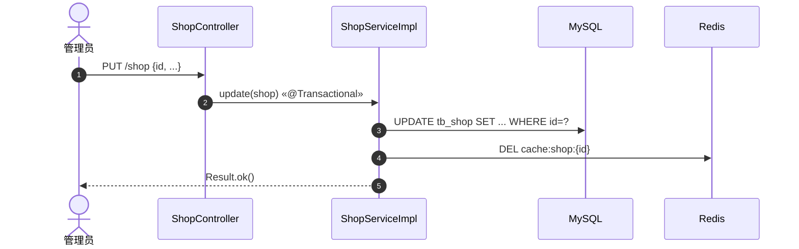

# 时序图 - 商铺查询（缓存击穿 - 逻辑过期）& GEO 附近商铺

## 1. 根据 ID 查询商铺（逻辑过期 + 异步重建）



## 2. 更新商铺（先写库，再删缓存）



## 3. 按类型 + 坐标查询附近商铺

```mermaid
sequenceDiagram
    autonumber
    actor U as 用户
    participant C as ShopController
    participant S as ShopServiceImpl
    participant R as Redis (GEO)
    participant DB as MySQL

    U->>C: GET /shop/of/type?typeId=&current=&x=&y=
    C->>S: queryShopByType(typeId, current, x, y)
    alt x or y == null
        S->>DB: page(eq type_id, current, size)
        DB-->>S: List<Shop>
        S-->>U: Result.ok(records)
    else 带坐标
        S->>S: from = (current-1)*size; end = current*size
        S->>R: GEOSEARCH shop:geo:{typeId} FROMLONLAT x y BYRADIUS 5000m WITHDIST LIMIT end
        R-->>S: GeoResults<shopId, distance>
        S->>S: 跳过前 from 个，收集 ids 与 distance map
        S->>DB: SELECT * FROM tb_shop WHERE id IN (...) ORDER BY FIELD(id, ...)
        DB-->>S: List<Shop>
        S->>S: shop.setDistance(distanceMap.get(id))
        S-->>U: Result.ok(shops)
    end
```
