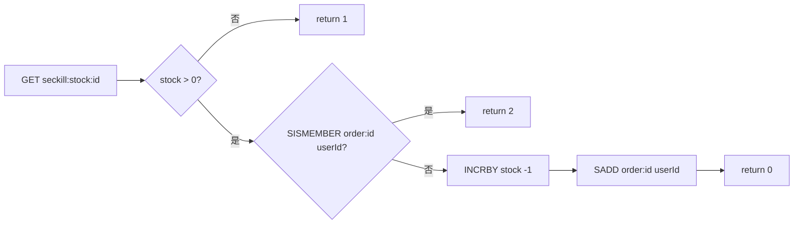

# 时序图 - 优惠券秒杀（Lua + Kafka 异步下单）

## 1. 下单主流程（同步部分 + 异步落库）

```mermaid
sequenceDiagram
    autonumber
    actor U as 用户
    participant C as VoucherOrderController
    participant S as VoucherOrderServiceImpl
    participant ID as RedisIdWorker
    participant R as Redis (执行 seckill.lua)
    participant K as Kafka (topic: seckill.orders)
    participant L as SeckillVoucherListener
    participant DB as MySQL

    U->>C: POST /voucher-order/seckill/{voucherId}
    C->>S: seckillVoucher(voucherId)

    S->>S: userId = UserHolder.getUser().getId()
    S->>ID: nextId("order")
    ID-->>S: orderId

    S->>R: EVAL seckill.lua [voucherId, userId]
    Note over R: 1) 校验库存 2) 校验一人一单<br/>3) INCRBY 扣库存 4) SADD 记录用户
    R-->>S: result (0=成功 / 1=库存不足 / 2=重复下单)

    alt result != 0
        S-->>U: Result.fail("库存不足" 或 "不能重复下单")
    else result == 0
        S->>S: 组装 VoucherOrder(orderId, userId, voucherId)
        S->>K: send(topic, key=voucherId, JSON(order))
        S-->>C: Result.ok(orderId)
        C-->>U: 200, orderId (&lt; 50ms)

        Note over K,L: ── 异步消费 (group: hmdp-seckill-group) ──
        K->>L: onSeckillOrder(record)
        L->>S: handleVoucherOrder(order)
        S->>DB: 一人一单校验 + 扣库存 + INSERT tb_voucher_order
    end
```

## 2. Lua 原子预检（防超卖 / 防重复）


